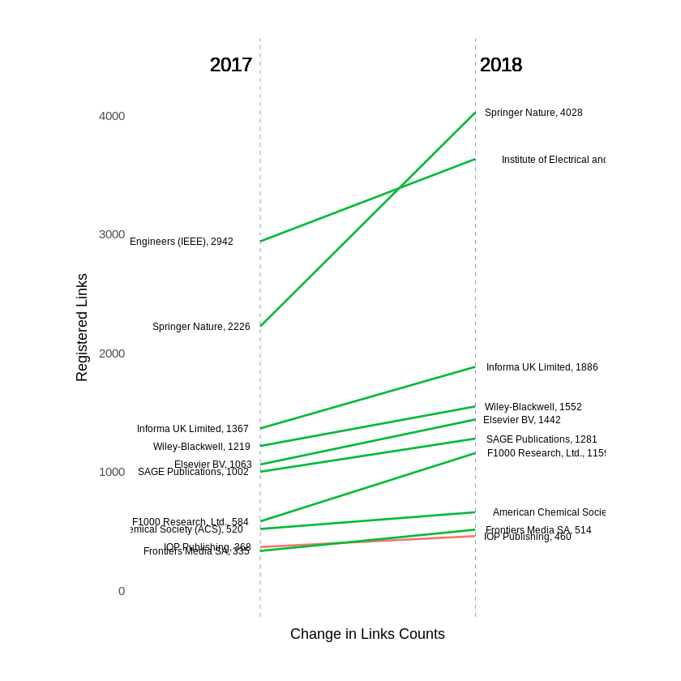
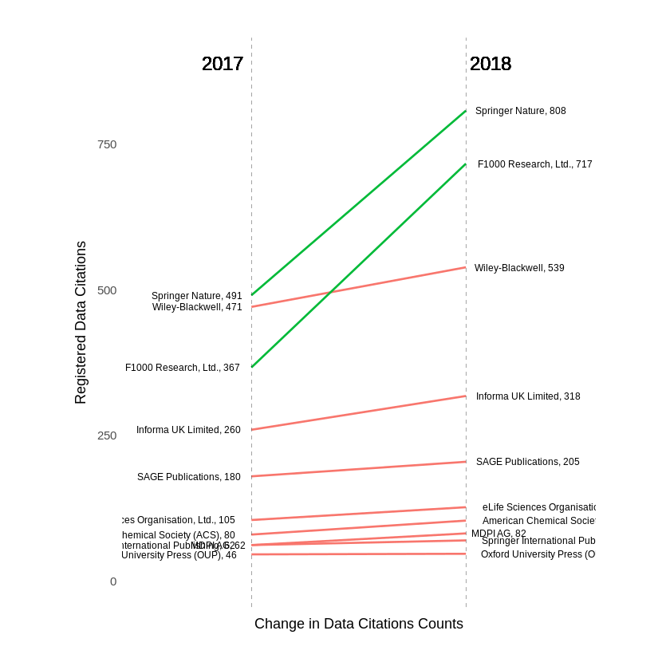

```R
install.packages("rdatacite")
install.packages("httr")
install.packages("purrrlyr")
library(ggplot2)
library(jsonlite)
library(dplyr)
library(stringr)
library(httr)
library("memoise")
library(purrrlyr)
```

    Updating HTML index of packages in '.Library'
    Making 'packages.html' ... done
    Updating HTML index of packages in '.Library'
    Making 'packages.html' ... done
    Updating HTML index of packages in '.Library'
    Making 'packages.html' ... done


## Exploration of Links between Crossref DOIs and DataCite DOIs
Kristian Garza 2018/03/15 08:41


This is a summary of information I have found in the eventdata dataset. I  examined links/events coming from Crossref. First, there is some information about the dataset. Later, I drill down to specific links involving DataCite DOIs with “dataset” type. 


I used the follow filter to get 22,000 records.
> https://query.eventdata.crossref.org/events?filter=source:crossref

The breakdown by Publisher shows Springer Nature and IEEE as the top contributors for links/events.


```R
load("../data/datalinks_type.Rda")
publishers <- data_pack_w_type %>% 
group_by(subj_dc) %>%  
    summarise(total = n())  %>%
arrange(desc(total))
head(publishers,10)
```

    Warning message:
    “Grouping rowwise data frame strips rowwise nature”


<table>
<thead><tr><th scope=col>subj_dc</th><th scope=col>total</th></tr></thead>
<tbody>
	<tr><td>Springer Nature                                         </td><td>4028                                                    </td></tr>
	<tr><td>Institute of Electrical and Electronics Engineers (IEEE)</td><td>3636                                                    </td></tr>
	<tr><td>Informa UK Limited                                      </td><td>1886                                                    </td></tr>
	<tr><td>Wiley-Blackwell                                         </td><td>1552                                                    </td></tr>
	<tr><td>Elsevier BV                                             </td><td>1442                                                    </td></tr>
	<tr><td>SAGE Publications                                       </td><td>1281                                                    </td></tr>
	<tr><td>F1000 Research, Ltd.                                    </td><td>1159                                                    </td></tr>
	<tr><td>American Chemical Society (ACS)                         </td><td> 661                                                    </td></tr>
	<tr><td>Frontiers Media SA                                      </td><td> 514                                                    </td></tr>
	<tr><td>IOP Publishing                                          </td><td> 460                                                    </td></tr>
</tbody>
</table>


To obtain the types of the of the Datacite DOIs I correlated the obj_id using the DataCite API. The resulting breakdown of the 22,000 links/events indicate that the most links/evetns are between Publications and Resources with "Text" as type. The type "Dataset" comes in a distance second place. There is also a sizeable amount that show no type in the DataCite API. 


```R
types <- data_pack_w_type %>% 
group_by(type) %>%  
    summarise(total = n())  %>%
arrange(desc(total))
types
```

    Warning message:
    “Grouping rowwise data frame strips rowwise nature”


<table>
<thead><tr><th scope=col>type</th><th scope=col>total</th></tr></thead>
<tbody>
	<tr><td>text                </td><td>14717               </td></tr>
	<tr><td>dataset             </td><td> 3566               </td></tr>
	<tr><td>                    </td><td> 2482               </td></tr>
	<tr><td>software            </td><td>  565               </td></tr>
	<tr><td>collection          </td><td>  434               </td></tr>
	<tr><td>other               </td><td>  125               </td></tr>
	<tr><td>workflow            </td><td>   42               </td></tr>
	<tr><td>image               </td><td>   38               </td></tr>
	<tr><td>audiovisual         </td><td>   19               </td></tr>
	<tr><td>interactive-resource</td><td>    6               </td></tr>
	<tr><td>model               </td><td>    3               </td></tr>
	<tr><td>physical-object     </td><td>    2               </td></tr>
	<tr><td>sound               </td><td>    1               </td></tr>
</tbody>
</table>


On data point that I think is important to confirm is "Elsevier BV". They have provided 1442 links/events but when you break it down by `type`, you realise that this links are to `text`, not to `dataset`.


```R
elsevier<- data_pack_w_type %>%
    filter(subj_dc == "Elsevier BV") %>%  
    group_by(type) %>%  
            summarise(total = n())  
elsevier
```

    Warning message:
    “Grouping rowwise data frame strips rowwise nature”


<table>
<thead><tr><th scope=col>type</th><th scope=col>total</th></tr></thead>
<tbody>
	<tr><td>          </td><td>   7      </td></tr>
	<tr><td>collection</td><td>   7      </td></tr>
	<tr><td>dataset   </td><td>  46      </td></tr>
	<tr><td>text      </td><td>1382      </td></tr>
</tbody>
</table>


Finally, we can look at the changes from March 2017 by looking at when the links/events occured (I am using the `occurred_at` field). We can see how there are more links for all Publishers but the slope is not steep. The main exception being Springer Nature. 


```R
get_summ_by_dc_dc_before<-function(data){
    data_type <- data %>%
        filter(occurred_at <= as.Date("2017-03-01")) %>%
        group_by(subj_dc) %>%  
            summarise(total = n())  %>%
        arrange(desc(total))
    return(data_type)
}


create_slope_data<-function(data){

    previous<-get_summ_by_dc_dc_before(data)
    colnames(previous)[2] <- "2017"
    
    last<-get_summ_by_dc_dc(data)
    colnames(last)[2] <- "2018"

    r <- previous %>% 
        rowwise() %>% 
        left_join(last)
    print(nrow(r))
    return(head(r,10)) 
}

get_summ_by_dc_dc<-function(data){
    data_type <- data %>% 
        group_by(subj_dc) %>%  
            summarise(total = n())  %>%

        arrange(desc(total))
    return(data_type)
}

plot_slopegraph<-function(slope_df){
    # Plot
    left_label <- paste(slope_df$subj_dc, round(slope_df$`2017`),sep=", ")
    right_label <- paste(slope_df$subj_dc, round(slope_df$`2018`),sep=", ")
    slope_df$class <- ifelse((slope_df$`2018` - slope_df$`2017`) < 100, "red", "green")

    p <- ggplot(slope_df) + geom_segment(aes(x=1, xend=2, y=`2017`, yend=`2018`, col=class), size=.75, show.legend=F) + 
                      geom_vline(xintercept=1, linetype="dashed", size=.1) + 
                      geom_vline(xintercept=2, linetype="dashed", size=.1) +
                      scale_color_manual(labels = c("Up", "Down"), 
                                         values = c("green"="#00ba38", "red"="#f8766d")) +  # color of lines
                      labs(x="Change in Links Counts", y="Registered Links") +  # Axis labels
                      xlim(.5, 2.5) + ylim(0,(1.1*(max(slope_df$`2017`, slope_df$`2018`))))  # X and Y axis limits

    # Add texts
    p <- p + geom_text(label=left_label, y=slope_df$`2017`, x=rep(1, NROW(slope_df)), hjust=1.1, size=2.5)
    p <- p + geom_text(label=right_label, y=slope_df$`2018`, x=rep(2, NROW(slope_df)), hjust=-0.1, size=2.5)
    p <- p + geom_text(label="2017", x=1, y=1.1*(max(slope_df$`2017`, slope_df$`2018`)), hjust=1.2, size=5)  # title
    p <- p + geom_text(label="2018", x=2, y=1.1*(max(slope_df$`2017`, slope_df$`2018`)), hjust=-0.1, size=5)  # title

    # Minify theme
    p + theme(panel.background = element_blank(), 
               panel.grid = element_blank(),
               axis.ticks = element_blank(),
               axis.text.x = element_blank(),
               panel.border = element_blank(),
               plot.margin = unit(c(1,2,1,2), "cm"))
}

plot_slopegraph(create_slope_data(data_pack_w_type))


```

    Warning message:
    “Grouping rowwise data frame strips rowwise nature”Warning message:
    “Grouping rowwise data frame strips rowwise nature”Joining, by = "subj_dc"


    [1] 222





It would be very helpful if you notice something off in the data I have so far so I can check If I have something wrong.

## Links/Events to Dataset Type 

For the RDA event the focus is only on those links/events that reference to `Dataset`. Therefore for the presenation I am showing only information for that subset which are 3566 links.

The breakdown by Crossref-type of the subset puts journal-article as the main type that makes links to Citations.


```R
load("../data/links_with_xref_data_2.Rda")
types <- xref_data %>% 
    group_by(type) %>%  
        summarise(total = n())  %>%
    arrange(desc(total)) 
types
```


<table>
<thead><tr><th scope=col>type</th><th scope=col>total</th></tr></thead>
<tbody>
	<tr><td>journal-article    </td><td>3461               </td></tr>
	<tr><td>book-chapter       </td><td>  99               </td></tr>
	<tr><td>monograph          </td><td>   3               </td></tr>
	<tr><td>proceedings-article</td><td>   2               </td></tr>
	<tr><td>reference-entry    </td><td>   1               </td></tr>
</tbody>
</table>


Similarly to the whole set of links/events we have increases in citations for all publishers but the slope is not significant.


```R
get_summ_by_dc_dc_before<-function(data){
    data_type <- data %>%
        filter(occurred_at <= as.Date("2017-03-01")) %>%
        group_by(publisher) %>%  
            summarise(total = n())  %>%
        arrange(desc(total))
    return(data_type)
}


create_slope_data<-function(data){

    previous<-get_summ_by_dc_dc_before(data)
    colnames(previous)[2] <- "2017"
    
    last<-get_summ_by_dc_dc(data)
    colnames(last)[2] <- "2018"

    r <- previous %>% 
        rowwise() %>% 
        left_join(last)
    print(nrow(r))
    return(head(r,10)) 
}

get_summ_by_dc_dc<-function(data){
    data_type <- data %>% 
        group_by(publisher) %>%  
            summarise(total = n())  %>%

        arrange(desc(total))
    return(data_type)
}

plot_slopegraph<-function(slope_df){
    # Plot
    left_label <- paste(slope_df$publisher, round(slope_df$`2017`),sep=", ")
    right_label <- paste(slope_df$publisher, round(slope_df$`2018`),sep=", ")
    slope_df$class <- ifelse((slope_df$`2018` - slope_df$`2017`) < 100, "red", "green")

    p <- ggplot(slope_df) + geom_segment(aes(x=1, xend=2, y=`2017`, yend=`2018`, col=class), size=.75, show.legend=F) + 
                      geom_vline(xintercept=1, linetype="dashed", size=.1) + 
                      geom_vline(xintercept=2, linetype="dashed", size=.1) +
                      scale_color_manual(labels = c("Up", "Down"), 
                                         values = c("green"="#00ba38", "red"="#f8766d")) +  # color of lines
                      labs(x="Change in Links Counts", y="Registered Links") +  # Axis labels
                      xlim(.5, 2.5) + ylim(0,(1.1*(max(slope_df$`2017`, slope_df$`2018`))))  # X and Y axis limits

    # Add texts
    p <- p + geom_text(label=left_label, y=slope_df$`2017`, x=rep(1, NROW(slope_df)), hjust=1.1, size=2.5)
    p <- p + geom_text(label=right_label, y=slope_df$`2018`, x=rep(2, NROW(slope_df)), hjust=-0.1, size=2.5)
    p <- p + geom_text(label="2017", x=1, y=1.1*(max(slope_df$`2017`, slope_df$`2018`)), hjust=1.2, size=5)  # title
    p <- p + geom_text(label="2018", x=2, y=1.1*(max(slope_df$`2017`, slope_df$`2018`)), hjust=-0.1, size=5)  # title

    # Minify theme
    p + theme(panel.background = element_blank(), 
               panel.grid = element_blank(),
               axis.ticks = element_blank(),
               axis.text.x = element_blank(),
               panel.border = element_blank(),
               plot.margin = unit(c(1,2,1,2), "cm"))
}

plot_slopegraph(create_slope_data(xref_data))

```

    Joining, by = "publisher"


    [1] 70





I am looking at further analyses. For example looking at `subjects` of the publications and which distribution of citation the datacite clients received. 
